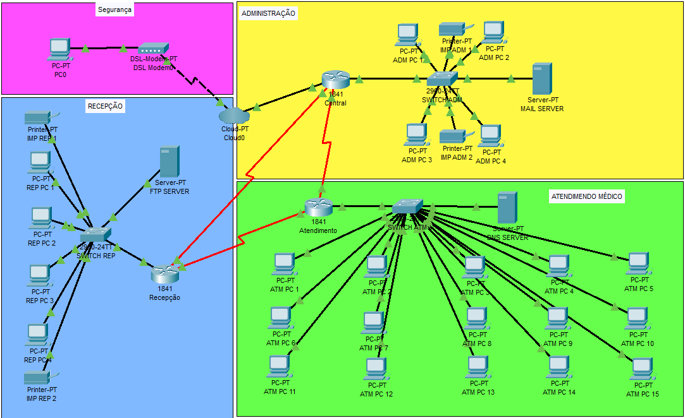

<h1 align="center">Simulação de Redes</h1>

  <strong>OTIMIZAÇÃO DA REDE DE SAÚDE: SIMULAÇÃO DE UM HOSPITAL NO CISCO PACKET TRACER</strong>

  <a href="#-tecnologias">Tecnologias</a>&nbsp;&nbsp;&nbsp;|&nbsp;&nbsp;&nbsp;
  <a href="#-projeto">Projeto</a>

 

  

---

## 🚀 Tecnologias

Esse projeto foi desenvolvido com as seguintes tecnologias:

- Cisco Packet Tracer

## 💻 Projeto

Projeto de simulação de uma rede hospitalar integrada, focada na otimização da comunicação entre setores e na proteção de dados sensíveis. 
O projeto está alinhado aos Objetivos de Desenvolvimento Sustentável (ODS) 3 e 9, utilizando os seguintes recursos:

- **DHCP** e **DNS** para gerenciamento dinâmico de endereços IP e resolução de nomes.
- **FTP** para transferência de arquivos segura.
- Medidas de segurança como **firewalls** e **redundância de rede**.

O modelo proposto é eficiente, seguro e replicável, promovendo inovação e sustentabilidade no setor de saúde.

---

Feito por Alunos da São Judas Unimonte

